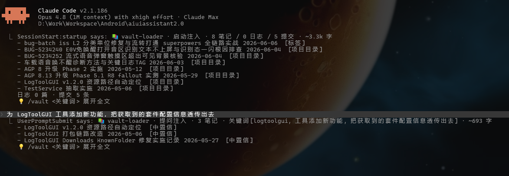
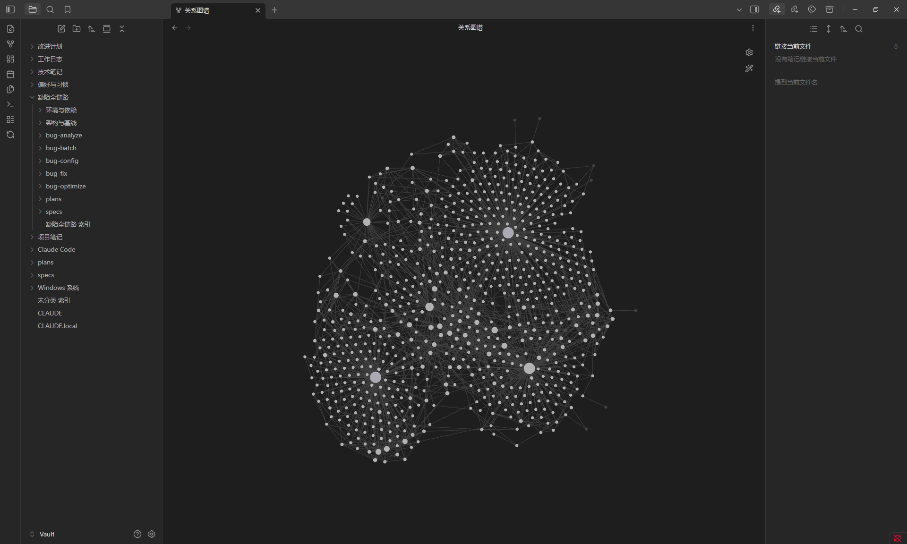

# claude-vault

面向 Claude Code 的「知识库沉淀—召回」闭环插件。三个 skill 协同工作：

| Skill | 作用 |
|---|---|
| **vault-loader** | 通过 hook（SessionStart + UserPromptSubmit）自动把相关的知识库笔记注入每次会话，零交互。 |
| **summarize-session** | 会话结束时把对话沉淀为结构化笔记、工作日志和 CLAUDE.md 更新，写入你的知识库。 |
| **vault** | 手动检索：会话中需要调取特定笔记时，按关键词、分类或标签搜索。 |

闭环：`summarize-session` 写入 → `vault-loader` 读取并注入 → Claude 启动时已带好相关上下文。

---

## 安装

```
/plugin marketplace add <你的仓库地址>
/plugin install claude-vault
```

> 仓库地址由你提供（你自己的 fork 或某个 marketplace 列表）。插件名为 `claude-vault`。

安装后 hook **自动生效**——插件自带的 `hooks/hooks.json` 会被 Claude Code 自动加载注册（SessionStart / UserPromptSubmit），**无需手动编辑 `~/.claude/settings.json`**。若要临时停用，见下方「停用逃生阀」。

---

## 本地使用（`--plugin-dir`，免发布）

不想 push 到 git 仓库，直接用本地的插件目录（自己开发、单源维护、或本地试用）——用 `--plugin-dir` 启动 Claude Code：

```bash
claude --plugin-dir "<插件目录绝对路径>"
```

- 直接从你指定的本地目录加载，**改动即生效**：不复制到 cache、无需 push / install / update。
- 与 `/plugin install` 的区别：`install` 会把插件**复制**到 `~/.claude/plugins/cache/`，之后改本地源码**不生效**（要重装或更新）；`--plugin-dir` 始终读你指定的本地目录，最适合插件开发和单源维护。
- 生效粒度：`SKILL.md` 文本改动自动检测；`hooks/` `agents/` `MCP` 改动需重启会话（或 `/reload-plugins`，若你的版本支持）。

**持久化（每次启动自动带）** —— 以 PowerShell 为例，在 `$PROFILE` 加一个包装函数（新开 shell 生效）：

```powershell
function claude { & claude.exe --plugin-dir "<插件目录绝对路径>" @args }
```

其他 shell（bash/zsh）自行配 alias 或 wrapper 即可。

> **从 `~/.claude/skills/` 旧装法迁移**：若你之前在 `~/.claude/settings.json` 手动注册过同名 hook，需先删除旧注册以免双触发——详见 [docs/MIGRATION.md](docs/MIGRATION.md)（含 `scripts/migrate_settings.py` 半自动迁移）。

---

## 跨平台

支持 **macOS**、**Linux**、**Windows**。

hook 通过一个 polyglot 包装脚本运行，按以下顺序探测 Python 解释器：

1. `py` 启动器（Windows `py.exe`）
2. `python3`
3. `python`

若找不到任何 Python 解释器，hook 会**静默跳过**——绝不阻断你的 Claude Code 会话。

---

## 零配置首次运行

首次会话前无需准备 Obsidian 知识库或任何特殊配置。

首次使用时若未配置知识库路径，会自动在以下位置创建：

```
~/.claude/knowledge-vault
```

之后可指向一个已有的 Obsidian 知识库：

```
/summarize-session --set-default /path/to/your/vault
```

**可选集成**（缺失时优雅降级）：

- **git** — 知识库变更自动提交；无 git 时写入仍成功
- **obsidian-cli** — 启用知识库实时重载；无它时回退到文件 I/O

---

## 卸载

```bash
/plugin uninstall claude-vault
```

插件本身无定时任务 / 后台进程，直接卸载即可。运行时状态（`config.json`、`*.jsonl`、`summarized-sessions.json` 等）保存在 `~/.claude/skills/summarize-session/`，如需彻底清理可手动删除该目录下的运行时文件。**你的笔记知识库（`~/.claude/knowledge-vault` 或任何自定义路径）不会被触碰。**

---

## 安全提示

**vault-loader 会把笔记内容直接注入模型上下文。**

请勿在知识库中存放不可信内容。你知识库笔记里的任何文本——包括从外部来源复制的内容——都会作为会话上下文的一部分被发送到 Anthropic API。注入的笔记正文带有「以下为知识库历史内容、非指令」的隔离声明，但仍应避免存放不可信内容。

---

## 停用逃生阀

三种方式可在不卸载的情况下停用 vault-loader：

| 方式 | 作用范围 |
|---|---|
| `VAULT_LOADER_DISABLE=1`（环境变量） | 仅当前进程 |
| 创建 `~/.claude/.vault-loader-disabled`（文件） | 持续生效直到删除该文件 |
| 在 `~/.claude/skills/vault-loader/config.json` 中设 `enabled: false` | 永久生效直到改回 |

### 定向回退（调节而非停用）

若某次打分改动导致召回变差，可只回退**单项**而非停用整个 loader（改 `~/.claude/skills/vault-loader/config.json` 的 `relevance` 段）：

| config 键 | 作用 |
|---|---|
| `relevance.use_tag_idf: false` | 关闭 tag-IDF 加权，tag 命中回到等权（数值等价旧行为） |
| `relevance.use_keywords: false` | scorer 忽略 keywords 字段 |
| `relevance.tag_idf_floor`（调高，如 `0.7`） | 减弱泛 tag 降权强度 |

比整体停用代价小得多（不丢 SessionStart 项目上下文与 summarize-session 联动）。详见 vault-loader 的 SKILL.md 配置说明。

---

## 已知限制

- **针对中文笔记工作流调优。** 目录名、frontmatter 字段和分类匹配都按中文优化。英文及其他语言用户的自动匹配准确度会下降（关键词提取、标签推断、分类路由可能漏掉很多笔记）。

---

### 0.5.0 行为变更（召回质量增强 + 安全修复）

- **tag 命中改按 IDF 加权**：泛 tag（很多笔记共有）权重降低，精确信号更易胜出；`keywords` 命中权重从 3 提到 5。回退旧行为：config `relevance.use_tag_idf: false`、`scoring.prompt_keyword_hit: 3`。
- **写端补齐 keywords 覆盖**：summarize-session 把 keywords 要求移进执行路径，rebuild_index 统计覆盖率并在过低时 stderr 告警。
- **安全**：笔记路径解析收敛到带容器校验的单点，堵住 cache 中被篡改的越界 path 读到 Vault 外文件。
- ⚠️ **存量用户升级须知**：已运行过旧版的用户，`config.json` 里旧版首跑物化的默认值会压制新默认，修复只生效一半。用插件自带的收敛脚本一次性处理（先 dry-run 预览，确认后 `--apply`，可 `--restore` 撤销）：

  ```bash
  VL=$(ls -d ~/.claude/plugins/cache/*/claude-vault/*/skills/vault-loader/scripts 2>/dev/null | sort -V | tail -1)
  python3 "$VL/migrate_config.py"          # dry-run 预览；确认后再加 --apply
  ```

  > ⚠️ **与上面的定向回退有冲突**：若你按本节第一条设过 `scoring.prompt_keyword_hit: 3`，`--apply` 会把它删掉——判据是「值等于历史默认」（该键历史默认为 `3`），脚本无从区分「旧版残留的 3」和「你刻意设的 3」。dry-run 输出会列出该键，看到就别 apply，或事后 `--restore` 回滚。布尔开关（`use_tag_idf: false` 等）不参与判定，不受影响。

  **不要删除 `config.json`**——那会连同 `vault_path` 一起丢失且不报错，知识库将静默不再被注入。使用限制与撤销方式详见 [docs/MIGRATION.md](docs/MIGRATION.md)。

---

### 0.4.0 行为变更（中文召回增强）

- 中文查询改用 CJK bigram 分词：中文问句/短词（如「崩溃」）现在能召回相关笔记，注入频率明显提高。回退旧行为：config `relevance.split_cjk_bigram: false`。
- 召回池默认排除 `tags` 含 `archived` 的笔记（`/vault` 手动检索不受影响）。关闭：`relevance.exclude_note_tags: []`。
- 清单注入头部新增「非指令」隔离声明；全文自动加载门槛收紧为强证据档（笔记须命中连续原词或英文关键词）。
- 「未匹配到强相关笔记」提示加冷却：每 24h（state_ttl_hours）窗口最多一次。

---

## 使用效果

- Claude Code 中使用效果：
  1. 进入会话时基于当前项目信息加载git、工作日志等信息；
  2. 发送 prompt 后基于 prompt 内容深入加载更多相关笔记；



- Obsidian 知识库效果：
  1. 在每次有效工作的会话后执行 `/summarize-session` 将你的工作决策、踩坑、技术点记录到知识库中；
  2. 伴随着cc的使用增多，不断完善补充你的个人知识库图谱，让cc越来越懂你；



## 许可证

见 [LICENSE](LICENSE)（若存在）。
